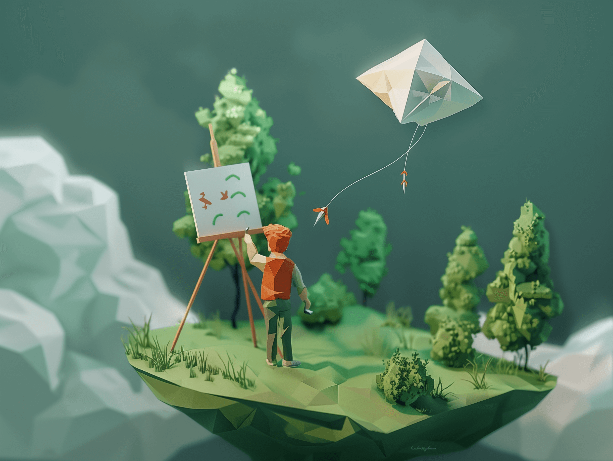
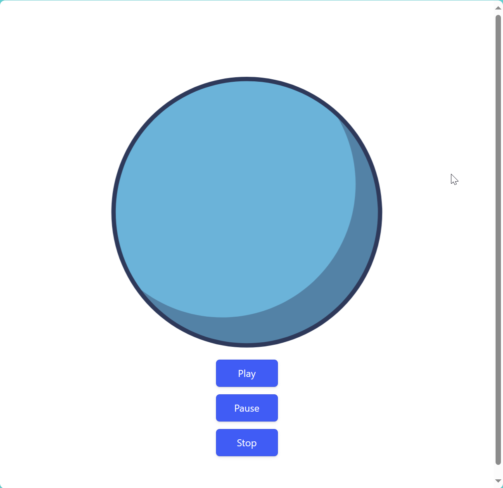
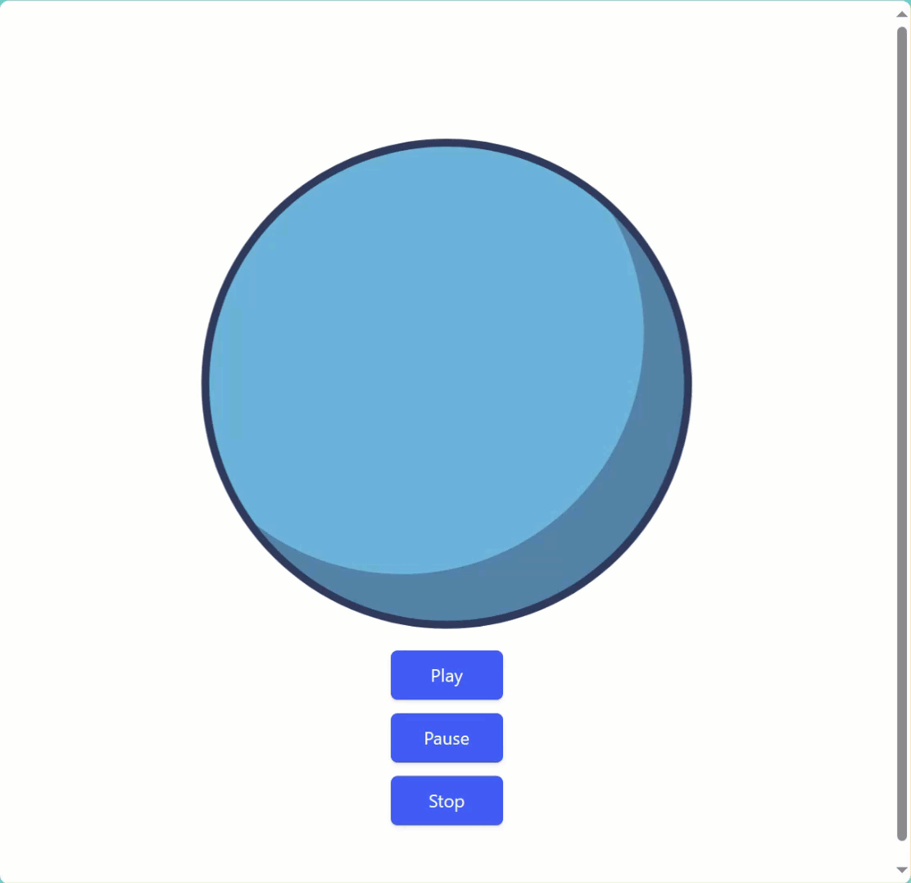

# Use Lottie animations in your Angular project



## Usage

First you need to install the `npm` packages [lottie-web](https://www.npmjs.com/package/lottie-web) and [ngx-lottie](https://www.npmjs.com/package/ngx-lottie).

Register the needed stuff in the `app.config.ts` file:
```typescript
import { provideCacheableAnimationLoader, provideLottieOptions } 
  from 'ngx-lottie';
import player 
  from 'lottie-web';

export const appConfig: ApplicationConfig = {
  providers: [
    provideLottieOptions({ player: () => player }),
    provideCacheableAnimationLoader(),
    // 
  ]
};
```

Use the `ng-lottie` tag in your `html` files:
```HTML
<ng-lottie 
    [options]="options" 
    width="500px" 
    height="500px" 
    (animationCreated)="animationCreated($event)" />
```

Open the corresponding `TypeScript` file and adjust the code accordingly. First we need to add `LottieComponent` to the `imports` array in the `Component` decorator.

```TypeScript
@Component({
    //
  imports: [LottieComponent],
    //
})
```

Add a reference to the `AnimationItem` and we define our `AnimationOptions`. These options contain the settings for the animation like the path or the setting if the animation should be played automatically or in a loop. Finally we add the `animationCreated` method to get access to the `AnimationItem`.

```TypeScript
private animationItem: AnimationItem | undefined;

options: AnimationOptions = {
  path: '/assets/animations/globe.json',
  loop: true,
  autoplay: false
};

animationCreated(animationItem: AnimationItem): void {
  this.animationItem = animationItem;
}
```

Use `this.animationItem` to start, pause or stop the animation accordingly. In my sample code, I'm using three buttons to control the animation.

## Screenshots

If you run your Angular project, you will see the starting position of the animation, in my case a blue globe and the three buttons.



The following GIF will show the website and also the animation in action.



## Blog Post

If you are more interested into details, please see the following [medium.com](https://www.medium.com) post:

- [Add Lottie animations to your Angular project](https://medium.com/medialesson/add-lottie-animations-to-your-angular-project-3e8f632d6212)